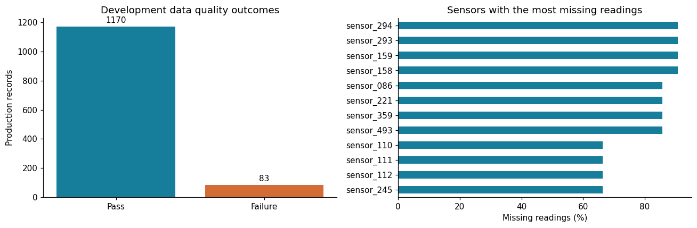
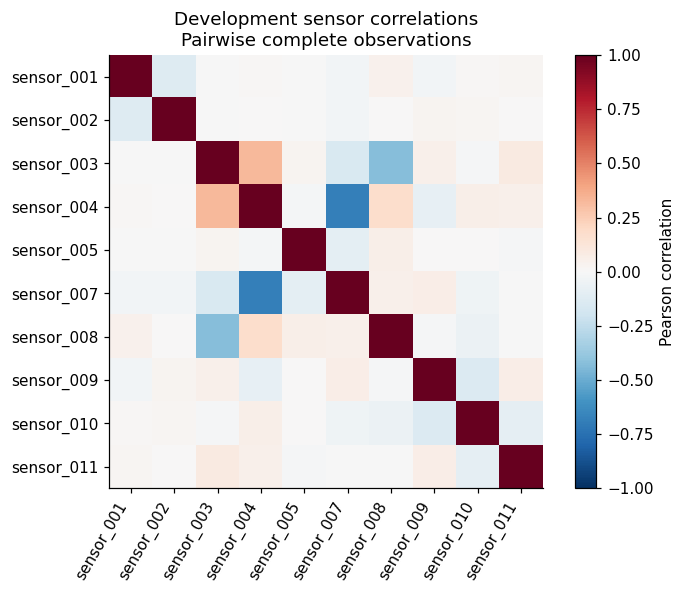
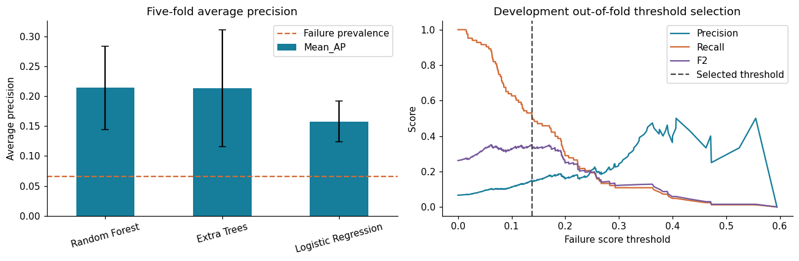
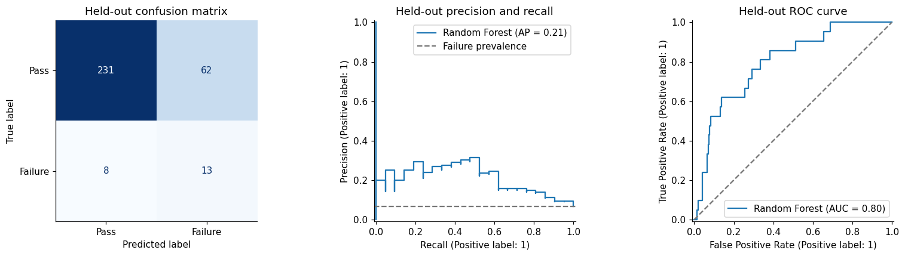
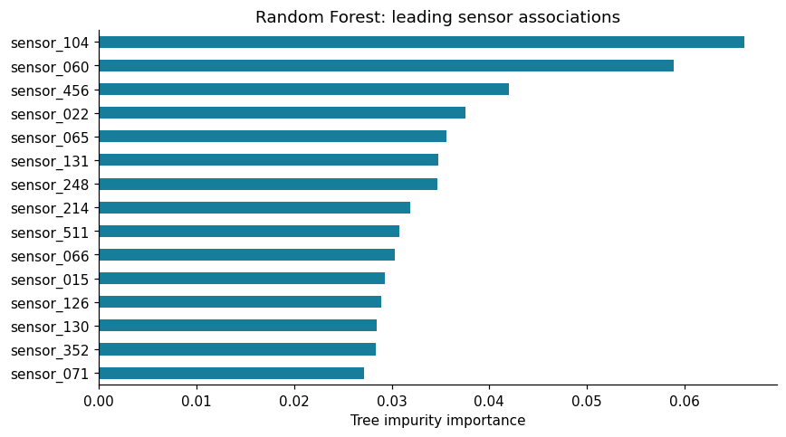

# Manufacturing Quality Prediction

[](https://manufacturing-quality-prediction.streamlit.app/)
[](https://www.python.org/)
[](https://scikit-learn.org/)
[](https://creativecommons.org/licenses/by/4.0/)

🔗 **Live Interactive App:** [https://manufacturing-quality-prediction.streamlit.app/](https://manufacturing-quality-prediction.streamlit.app/)

---

**Author:** Poojan Chauhan  
**Program:** IBM SkillsBuild Data Analytics with AI Academic Internship  
**Conducted by:** BharatCares in association with AICTE

---

## Project Overview

In semiconductor fabrication, early detection of defective chips is critical for minimizing yield losses and manufacturing costs. This project builds an end-to-end, leakage-free machine learning pipeline on the **SECOM** dataset (1,567 production runs and 590 sensor signals) to flag defective wafers for physical inspection before packaging.

Key highlights:
- **Data Quality & Leakage Prevention:** Preprocessing steps (missingness filtering, median imputation, variance thresholding, standard scaling) are fitted strictly within training folds.
- **Model Comparison:** Evaluates class-weighted Logistic Regression, Random Forest, and Extra Trees using 5-fold Stratified Cross-Validation on Average Precision (AP).
- **Threshold Optimization for Recall:** In defect detection, a false negative (missed defect reaching client) is much costlier than a false positive (inspection re-test). The decision threshold is tuned to maximize **$F_2$-Score** on out-of-fold predictions.
- **Interactive Streamlit Web Dashboard:** Includes live single-wafer inspection, batch CSV quality scoring, interactive charts, and model explainability.

---

## Visualizations & Model Insights

All visualizations are generated from the experimental evaluation pipeline in `PoojanChauhan_ManufacturingQualityPrediction.ipynb`.

### 1. Data Quality & Sensor Missingness

* **Left Panel:** Extreme class imbalance in the training cohort (1,463 Pass vs 104 Fail records, ~6.6% failure prevalence).
* **Right Panel:** Sensor missing-data profile. Several anonymous sensor channels exhibit over 50–60% missing values, necessitating robust missing-value pruning (>60% threshold) and median imputation prior to feature selection.

---

### 2. Sensor Correlation Structure

* Pairwise Pearson correlation heatmap across representative non-constant sensor channels.
* Strong collinearity clusters appear across multiple sensor stages, demonstrating the need for automated feature ranking (ANOVA F-statistic) to eliminate redundant signals.

---

### 3. Model Benchmark & Decision Threshold Tuning

* **Left Panel (5-Fold CV Average Precision):** Random Forest achieves the strongest mean Average Precision ($0.21 \pm 0.04$), significantly outperforming the naive baseline (~0.067).
* **Right Panel ($F_2$ Threshold Optimization):** At the standard 0.50 classification threshold, extreme class imbalance causes the model to predict pass on 100% of samples. By sweeping the decision threshold on out-of-fold probabilities and maximizing $F_2$, an operational threshold of **0.1377** is selected, striking an optimal balance between defect recall and inspection workload.

---

### 4. Held-Out Test Set Performance

* **Confusion Matrix (Left):** On 314 held-out production runs (21 real defects), the tuned Random Forest captures **13 of 21 defects (61.9% recall)** with 231 true passes correctly identified.
* **Precision-Recall Curve (Center):** Demonstrates sustained detection capability over random guessing.
* **ROC Curve (Right):** Attains an **AUC of 0.7972**, confirming robust ranking discrimination between passing and defective semiconductor units.

---

### 5. Top Predictive Sensor Features

* Gini feature importance ranking for the top 15 discriminative sensors in the trained Random Forest classifier.
* Highlights primary sensor channels that correlate most strongly with semiconductor process deviations.

---

## Submission files

| File | Purpose |
|---|---|
| `PoojanChauhan_ManufacturingQualityPrediction.ipynb` | Complete Python notebook with saved outputs and optional Streamlit app exporter |
| `requirements.txt` | Runtime and notebook dependencies |
| `PoojanChauhan_ProjectReport.docx` | Project documentation, actual results, figures and limitations |
| `README.md` | Dataset source, project overview and setup instructions |

## Dataset and attribution

- **Dataset:** SECOM, UCI Machine Learning Repository.
- **Dataset link:** https://archive.ics.uci.edu/dataset/179/secom
- **Direct ZIP:** https://archive.ics.uci.edu/static/public/179/secom.zip
- **Citation:** McCann, M. and Johnston, A. (2008). SECOM [Dataset]. UCI Machine Learning Repository.
- **DOI:** https://doi.org/10.24432/C54305
- **License:** CC BY 4.0 — https://creativecommons.org/licenses/by/4.0/
- **Raw measurements:** 1,567 production records and 590 anonymous numeric sensor columns.
- **Labels:** 1,463 pass records and 104 failures; original -1/1 labels become 0/1.
- **Time range:** July–October 2008. Timestamps are not used as predictors.

The UCI descriptive page lists 591 features; the downloaded measurement matrix contains 590
sensor columns, with labels and timestamps supplied separately. `sensor_001` corresponds
to original raw column 0. Physical sensor names and units are unavailable. Original measurements
are not fabricated or modified; preprocessing is learned within the model pipeline.

## Technologies

Python, NumPy, pandas, Matplotlib, scikit-learn, Jupyter and Streamlit.
The app uses CPU-based models and does not require a GPU, paid service or API key.
The saved analysis used Python 3.12.14 and the core versions pinned in requirements.txt.

## Run locally on Windows

Install Python 3.12, extract the ZIP, and open Command Prompt in the extracted folder:

```bat
py -3.12 -m venv .venv
.venv\Scripts\activate
python -m pip install -r requirements.txt
python -m jupyter lab PoojanChauhan_ManufacturingQualityPrediction.ipynb
```

Select the virtual environment's Python kernel and choose **Run All Cells**.
On macOS/Linux, create the environment with `python3 -m venv .venv` and activate
it with `source .venv/bin/activate`; the remaining Python commands are the same.
Installation and the first dataset download require internet access.

## Run in Google Colab

1. Upload the notebook to https://colab.research.google.com/.
2. Upload `requirements.txt` into the current Colab session if matching the recorded environment.
3. In a new setup cell, run `%pip install -r requirements.txt`.
4. Restart the session if prompted after package changes, then run all notebook cells in order.
   JupyterLab is unnecessary in Colab but is included for local notebook use.

The notebook already contains output tables and charts for inspection without rerunning.
Rerunning recalculates all results from the real dataset.

## Data download and offline fallback

The loader downloads the official ZIP once into `data/`, then uses cached raw files.
If UCI is unavailable, download the ZIP manually from the dataset link and place
`secom.data` and `secom_labels.data` in `data/` under your current working directory.
Alternatively put the original archive at `data/secom.zip`.
The loader never substitutes synthetic data. The dataset is not bundled in this four-file ZIP.

## Methodology

1. Reserve a fixed stratified 20% test set (314 records, including 21 failures); seed 42.
2. Use the remaining 1,253 records (83 failures) for analysis and five-fold model selection.
3. In each training fold, remove sensors with more than 60% missing readings or no variation.
4. Impute missing values with training medians, select 40 ANOVA-ranked sensors, and standardize.
5. Compare class-weighted Logistic Regression, Random Forest and Extra Trees.
6. Select the highest mean cross-validation average precision (AP).
7. Maximize F2 on the selected model's out-of-fold development predictions to set the threshold.
8. Fit on all development rows and evaluate on the held-out test set once.

F2 favors recall. No factory-specific financial cost function or probability calibration is fitted.
AP is average precision, not accuracy or trapezoidal precision-recall area.

## Actual results

Selected model: **Random Forest**. Training-derived threshold: **0.137692**.

| Test metric | Always-pass baseline | Selected model at OOF threshold |
|---|---:|---:|
| Accuracy | 93.31% | 77.71% |
| Balanced accuracy | 50.00% | 70.37% |
| Failure precision | 0.00% | 17.33% |
| Failure recall | 0.00% | 61.90% |
| Failure F1 | 0.0000 | 0.2708 |
| Failure F2 | 0.0000 | 0.4088 |
| Average precision | 0.0669 | 0.2108 |
| ROC AUC | 0.5000 | 0.7972 |

Confusion counts: **231 true negatives, 62 false positives, 8 false negatives and 13 true positives**.
The model catches 13 of 21 failures, but 62 of 75 flagged records actually passed.
The approximate 95% Wilson interval for failure recall is 40.9%–79.2%.
At the default 0.50 threshold, this Random Forest predicts every test record as pass.
High accuracy alone would therefore hide a failure to detect defects.

## Predictions

Use the notebook's `predict_quality` function for a single-row or multi-row pandas DataFrame.
The frame must have exactly `sensor_001` through `sensor_590`; column order is normalized.
Do not include a target, timestamp or saved index column. Values must be numeric or blank.
Rows must have at least 295 observed readings and at least half of the selected model sensors.
Blank values use training medians. The input must use the same SECOM schema and scales.

The optional app supports an editable held-out sample demo and CSV batch predictions.
Its upload limit is 10 MB and 10,000 rows; output CSVs include scores and inspection decisions.

## Optional Streamlit app

1. Run all notebook cells.
2. In section 13, set `EXPORT_STREAMLIT_APP = True` and run that cell.
3. It creates `streamlit_export/app.py`. Existing files are preserved unless `OVERWRITE_APP = True`.
4. With the environment above activated, run from the submission folder:

```bash
python -m streamlit run streamlit_export/app.py
```

The four pages are Overview, Sensor analysis, Model evaluation and Predict quality.
The first startup downloads data and trains models; Streamlit caches the fitted experiment
for subsequent interactions. Training is repeated when the process restarts.

For Community Cloud, upload the generated `app.py` and the supplied `requirements.txt`
to a GitHub repository, select `app.py` as the entry point and use Python 3.12.
The notebook itself is not the Streamlit entry point. No public app has been deployed yet.

## Verification

All 20 notebook code cells were executed with no cell errors. Checks verify feature counts,
bounded scores, identical predictions after column reordering, and rejection of missing columns,
nonnumeric text, infinity and excessively incomplete rows. The exported app's four pages and
batch-mode navigation passed Streamlit AppTest checks. Cloud deployment and browser layout
were not part of these checks.

## Limitations and future improvements

There are few failed records and the data is historical. A random split is not evidence of
future-factory performance; validate chronologically and on independent production batches.
Scores are uncalibrated and sensor importance is associational, not causal. F2 is an academic
threshold objective; deployment requires actual inspection and missed-failure costs.
Future work includes calibrated scores, nested tuning, missingness indicators and drift monitoring.
Do not repeatedly tune against the held-out results in this submission.

## References

- Dataset: https://doi.org/10.24432/C54305
- Pipelines and leakage: https://scikit-learn.org/stable/common_pitfalls.html
- Average precision: https://scikit-learn.org/stable/modules/generated/sklearn.metrics.average_precision_score.html
- Streamlit: https://docs.streamlit.io/get-started/tutorials/create-an-app
- Hosting dependencies: https://docs.streamlit.io/deploy/streamlit-community-cloud/deploy-your-app/app-dependencies
